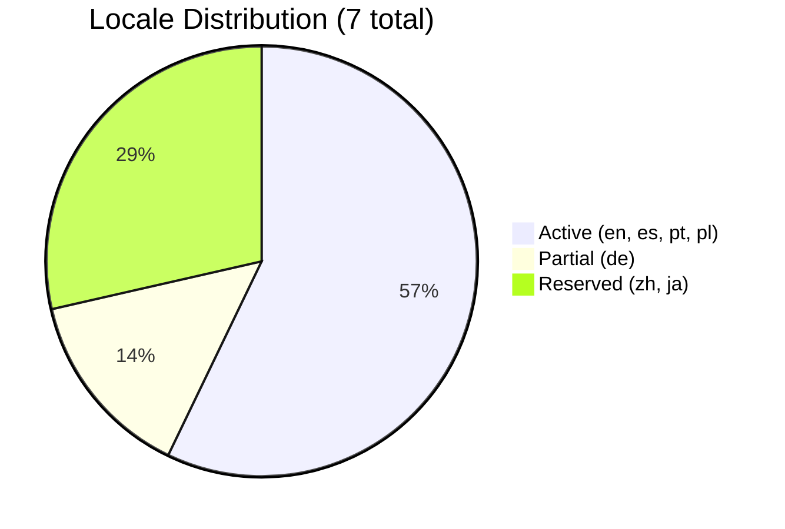
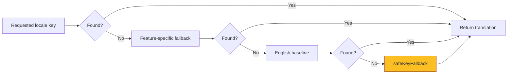

# Locale Platform Architecture

> Phase G-0 Authoritative Locale Architecture
> Version: 1.0
> Date: 2026-07-28

---

## Overview

The locale platform provides a **single source of truth** for all locale-related concerns in Somna. It replaces three previously competing locale type systems (`Lang`, `Locale`, content locale) with one authoritative registry.

```mermaid
graph TB
    subgraph "Authoritative Source"
        LR[locale-registry.ts<br/>LOCALE_REGISTRY]
    end

    subgraph "UI / Route Layer"
        LD[lang-detect.ts<br/>Lang = SupportedLocale<br/>ACTIVE_LANGS = ACTIVE_LOCALES]
        I18N[i18n.tsx<br/>Lang = SupportedLocale<br/>resolveTranslation()]
        Header[Header.tsx]
        Routes[Route prefixes]
    end

    subgraph "Content Layer"
        CT[content-types.ts<br/>ContentLocale<br/>uiLocaleToContentLocale()]
        Content[Content packages<br/>en, es, pt-BR, pl, de]
    end

    subgraph "Server / Sync Layer"
        Auth[auth-types.ts<br/>Locale]
        Sync[sync-types.ts]
    end

    LR --> LD
    LR --> I18N
    LR --> CT
    CT --> Content
    I18N --> Header
    LD --> Routes

    style LR fill:#4ade80,stroke:#166534,stroke-width:2px
```

---

## Core Concepts

### Locale Tiers

| Tier | Status | Locales | Description |
|------|--------|---------|-------------|
| **Active** | enabled: true | en, es, pt, pl | Full UI + routes + content. hreflang-exposed. |
| **Partial** | enabled: false | de | In-progress translation. Loaded but not advertised. |
| **Reserved** | enabled: false | zh, ja | Reserved for future. No routes, no content. |



### UI Locale vs Content Locale

UI locale codes (short, route-friendly) may differ from content locale codes (IANA language tags).

| UI Locale | Content Locale | HTML lang | hreflang |
|-----------|---------------|-----------|----------|
| en | en | en-US | en |
| es | es | es-ES | es |
| pt | pt-BR | pt-BR | pt-BR |
| pl | pl | pl-PL | pl |
| de | de | de-DE | de |
| zh | zh-CN | zh-CN | zh-CN |
| ja | ja | ja-JP | ja |

**Why pt → pt-BR?** The existing content system uses `"pt-BR"` as the content locale key (matching content directory naming), while the UI uses `"pt"` for routes and user preference storage. The `getContentLocale()` function maps between them.

---

## Fallback Chain

The translation resolution function `resolveTranslation()` uses a 4-tier fallback that **never shows raw dotted keys** to users:



### safeKeyFallback

Converts missing keys to human-readable form instead of showing raw dotted paths:
- `"dashboard.weeklyFocus.title"` → `"Title"`
- `"sleep_efficiency"` → `"Sleep Efficiency"`
- `"weeklyFocus"` → `"Weekly Focus"`

This ensures users never see cryptic dotted paths while still giving developers enough context to find the missing key.

---

## Migration Paths

### Legacy pt-BR → pt

Users who have `"pt-BR"` saved in localStorage or cookies from earlier versions are automatically normalized to `"pt"`:

```
normalizePersistedLocale("pt-BR") → "pt"
normalizePersistedLocale("pt-br") → "pt"
normalizePersistedLocale("PT-BR") → "pt"
normalizePersistedLocale("pt-PT") → "pt"
```

### Full region tag mappings (LEGACY_LOCALE_MAP)

| Legacy Tag | Canonical |
|-----------|-----------|
| en-US | en |
| es-ES | es |
| pt-BR | pt |
| pl-PL | pl |
| de-DE | de |
| zh-CN | zh |
| ja-JP | ja |

Prefix matching also handles unknown region variants (e.g. `"es-MX"` → `"es"`).

### Unknown → English fallback

```
normalizePersistedLocale("fr") → "en"
normalizePersistedLocale(null) → "en"
normalizePersistedLocale("") → "en"
```

Custom fallback locale can be provided as second argument.

---

## Type Guard Functions

| Function | Returns true for |
|----------|-----------------|
| `isSupportedLocale(v)` | All 7 locales |
| `isActiveLocale(v)` | en, es, pt, pl |
| `isPartialLocale(v)` | de |
| `isReservedLocale(v)` | zh, ja |

All guards are type predicates (`v is X`) so TypeScript narrows types automatically.

---

## Files & Ownership

| File | Responsibility |
|------|---------------|
| `src/lib/locale-registry.ts` | **Authoritative** — definitions, guards, normalization, fallback |
| `src/lib/lang-detect.ts` | Browser detection, cookie/localStorage persistence, route parsing |
| `src/lib/i18n.tsx` | React i18n context + `t()` function |
| `src/content/content-types.ts` | Content package types, ContentLocale, ui↔content mapping |
| `src/components/Header.tsx` | Language switcher UI (uses SupportedLocale) |

### Deprecation Path

- `Lang` type is deprecated in `lang-detect.ts` and `i18n.tsx` → use `SupportedLocale`
- `Locale` type is deprecated in `content-types.ts` → use `ContentLocale`
- Both aliases still work for backward compatibility; removal targeted for Phase G-1

---

## SSR Safety

- `isBrowser()` guard prevents any `window` / `localStorage` access on server
- `safeLocalStorageGet/Set/Remove` used for all locale storage operations
- `getBrowserLang()` returns `"en"` on server
- `getSavedUserLang()` returns `null` on server
- `resolveTranslation()` is pure and works in any environment
