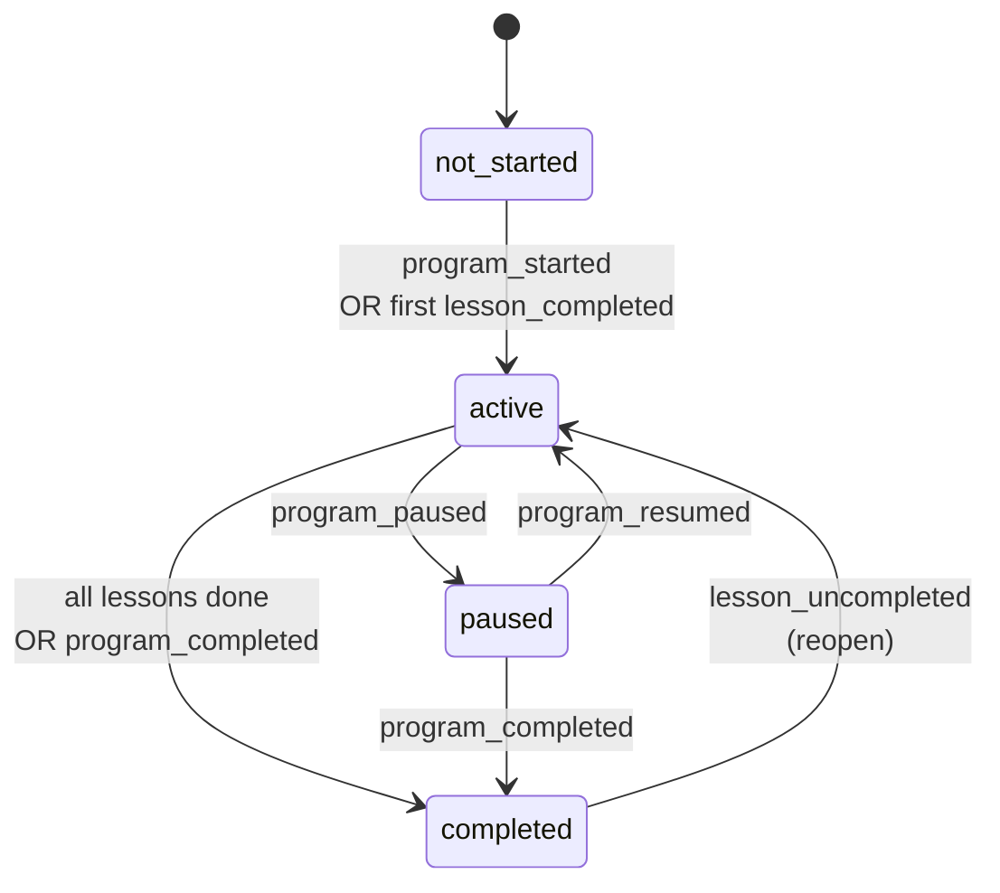
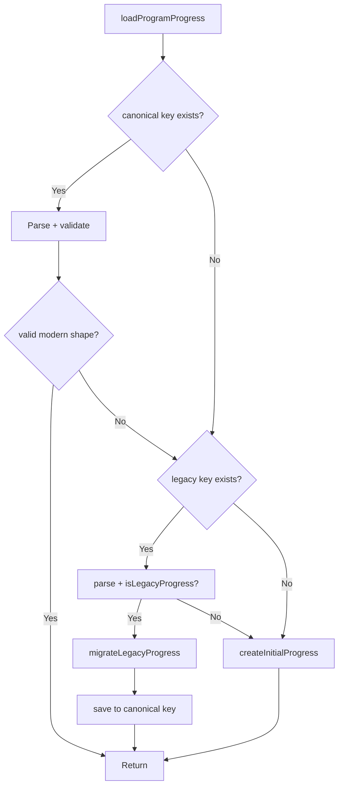

# Program Domain Architecture

> Phase G-0 Program Domain Foundation
> Version: 1.0
> Date: 2026-07-28

---

## Overview

The Program domain models a 6-week CBT-I (Cognitive Behavioral Therapy for Insomnia) program with 18 lessons. It uses an **event-sourced state machine** for progress tracking, with clear boundaries between the program module and other domains (Diary, Reminder, Sync, Weekly Focus).

```mermaid
graph TB
    subgraph "Program Domain (owned by src/lib/program/)"
        T[types.ts<br/>ProgramDefinition<br/>ProgramProgress<br/>ProgramEvent]
        SVC[service.ts<br/>applyEvent()<br/>state machine<br/>migration]
        STORAGE[storage.ts<br/>SSR-safe persistence<br/>export/delete]
        DEF[definition.ts<br/>adapter from lessonMetas]
        WP[weekly-plan.ts<br/>WeeklyProgramPlan<br/>validation]
        WFA[weekly-focus-adapter.ts<br/>WeeklyFocus → Program]
        RC[reminder-contract.ts<br/>Program ↔ Reminder boundary]
        SC[sync-contracts.ts<br/>Sync/Canonical types<br/>merge strategies]
    end

    subgraph "Existing Systems"
        LM[program-lessons.ts<br/>lessonMetas array]
        DIARY[Diary / Reflections]
        REM[Reminder Service]
        WF[Weekly Focus (Phase F)]
        SYNC[Sync Service]
        EXPORT[Export / Delete Flow]
    end

    DEF --> LM
    SVC --> T
    STORAGE --> SVC
    WP --> T
    WFA --> WF
    RC --> REM
    SC --> SYNC
    STORAGE --> EXPORT

    style T fill:#4ade80,stroke:#166534,stroke-width:2px
```

---

## Core Entities

### ProgramDefinition

The immutable "what the program is" document. Built from existing `lessonMetas` — no content duplication.

```
ProgramDefinition
├── id: "cbti-core"
├── version: 1
├── titleKey / descriptionKey (i18n)
├── weeks[6] (ProgramWeekDefinition)
│   ├── id, order
│   ├── titleKey, summaryKey
│   ├── lessonIds[3]
│   └── prerequisiteWeekIds?
└── lessons[18] (ProgramLessonDefinition)
    ├── id, weekId, order
    ├── titleKey, summaryKey
    ├── contentRef (path to full content)
    ├── estimatedMinutes?, difficulty, tags
    └── relatedLessonIds[]
```

### ProgramProgress

The mutable "how the user is doing" document. Versioned and event-sourced.

```
ProgramProgress
├── schemaVersion: 1
├── programId: "cbti-core"
├── programVersion: number
├── status: not_started | active | paused | completed
├── startedAt: ISO | null
├── completedAt: ISO | null
├── currentWeekId: string | null
├── completedLessonIds: string[]
├── skippedLessonIds: string[]
├── acceptedPlanIds: string[]
├── dismissedRecommendationIds: string[]
├── milestones[3]: { id, titleKey, descriptionKey, earnedAt, weekId? }
├── updatedAt: ISO
└── userId?: string (set server-side)
```

### State Machine



| Transition | Valid? |
|-----------|--------|
| not_started → active | ✅ |
| not_started → paused | ❌ |
| not_started → completed | ❌ |
| active → paused | ✅ |
| active → completed | ✅ |
| paused → active | ✅ |
| paused → completed | ✅ |
| completed → active | ✅ (reopen) |

---

## Event Model (11 Event Types)

| Event | Trigger | Effect |
|-------|---------|--------|
| `program_started` | User starts program | status→active, startedAt, currentWeekId→week-1 |
| `program_paused` | User pauses | status→paused |
| `program_resumed` | User resumes | status→active |
| `program_completed` | All lessons done | status→completed, completedAt |
| `lesson_completed` | User marks lesson done | Add to completedLessons, auto-start, milestones |
| `lesson_uncompleted` | User unmarks lesson | Remove from completedLessons, maybe reopen |
| `lesson_skipped` | User skips lesson | Add to skippedLessonIds |
| `lesson_unskipped` | User unskips | Remove from skippedLessonIds |
| `weekly_plan_accepted` | User accepts weekly plan | Add to acceptedPlanIds |
| `weekly_plan_dismissed` | User dismisses plan | Add to dismissedRecommendationIds |
| `milestone_earned` | Milestone achieved | Mark earnedAt |

**All events are idempotent.** Applying the same event twice produces the same result.

---

## Milestone System

Three default milestones, all earned automatically based on week completion:

| ID | Trigger | Type |
|----|---------|------|
| `sleep-basics` | Week 1 complete | week_completion |
| `behavior-change` | Week 3 complete | week_completion |
| `program-completed` | Week 6 complete | program_completion |

Milestones are **revocable**: if a lesson is un-completed and the week is no longer fully complete, the milestone is revoked (earnedAt → null).

---

## Boundary Contracts

### Weekly Focus → Program Adapter

**Direction**: Weekly Focus (Phase F) → Program domain input

```mermaid
graph LR
    WF[WeeklyFocusSummary<br/>from Phase F] --> ADAPTER[buildProgramRecommendationInput()]
    ADAPTER --> PRI[ProgramRecommendationInput<br/>stable contract]
    PRI --> FUTURE[Phase G:<br/>adaptive lesson selection]

    style PRI fill:#4ade80,stroke:#166534
```

The adapter is **categorical only** — it maps focus categories to lesson domains (tags). It does NOT select specific lessons. That's a Phase G responsibility.

### Program ↔ Reminder Boundary

**Hard boundary**: Program domain CANNOT create reminders.

```mermaid
graph LR
    P[Program Domain] -->|ProgramReminderRequest<br/>(proposal only)| R[Reminder Service]
    R -->|ProgramReminderOutcome| P
    P -->|outcomeAffectsProgramProgress<br/>= false<br/>explicit no-op| P

    style P fill:#4ade80,stroke:#166534
    style R fill:#60a5fa,stroke:#1e3a8a
```

- `validateReminderRequest()` — validates request shape
- `outcomeAffectsProgramProgress()` → always returns `false` (explicit boundary enforcement)
- User confirmation is mandatory before any reminder is scheduled

### Export / Delete Ownership

Program data is fully owned by the program module:
- `exportProgramData(definition)` — returns `{ progress, plans, exportedAt }`
- `deleteAllProgramData()` — clears all program localStorage keys
- Server-side already includes `program_progress` in account export/delete

---

## Persistence

### Storage Keys

| Key | Contents | Migration |
|-----|----------|-----------|
| `somna:program-progress:v1` | Canonical ProgramProgress | Current |
| `cbtiProgramProgress` | Legacy `{completedLessons: string[]}` | Read-only, auto-migrates to v1 |
| `somna:program-plans:v1` | WeeklyProgramPlan[] | Current |

### Migration Flow



### SSR Safety

All storage operations use `safeLocalStorageGet/Set/Remove` from `@/lib/safe-storage`:
- Server → returns defaults / no-ops
- Corrupt JSON → returns defaults (never throws)
- Quota errors → silently ignored in production

---

## File Map

| File | Responsibility | Tests |
|------|---------------|-------|
| `types.ts` | All program domain types, derived functions | — (types only) |
| `service.ts` | Event-sourced state machine, migration | `service.test.ts` (38 tests) |
| `storage.ts` | SSR-safe persistence, export/delete | `storage.test.ts` (12 tests) |
| `definition.ts` | Adapter from lessonMetas, validation | `definition.test.ts` (19 tests) |
| `weekly-plan.ts` | Weekly plan contract + storage | `weekly-plan.test.ts` (20 tests) |
| `weekly-focus-adapter.ts` | WeeklyFocus → Program input | — (pure adapter) |
| `reminder-contract.ts` | Program ↔ Reminder boundary | — (contract only) |
| `sync-contracts.ts` | Sync types + merge strategies | `sync-contracts.test.ts` (24 tests) |

**Total test coverage for program domain**: 113 tests across 6 test files
