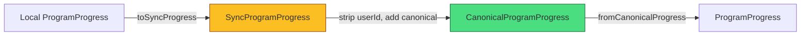
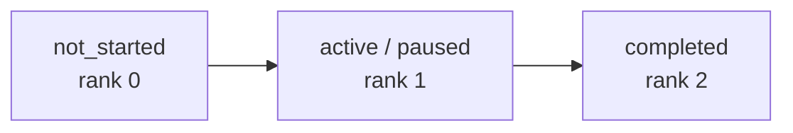
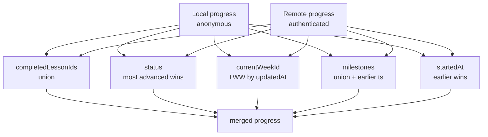

# Program Sync Contracts

> Phase G-0 Program Sync Foundation
> Version: 1.1
> Date: 2026-07-29

---

## Overview

This document defines the sync contracts for Program domain entities (progress and weekly plans). These are designed to integrate with the existing sync system while maintaining program-specific integrity rules.

```mermaid
graph TB
    subgraph "Client"
        Local[Local ProgramProgress<br/>localStorage]
        SyncQ[Sync Queue<br/>somna:sync-queue]
        Local -- toSyncProgress --> SyncQ
    end

    subgraph "Server"
        Server[Server ProgramProgress<br/>D1 program_progress table]
        CRUD[Sync API<br/>/api/sync]
    end

    subgraph "Wire Format"
        SyncP[SyncProgramProgress]
        SyncPlans[SyncWeeklyProgramPlan]
    end

    subgraph "Merge Layer"
        Merge[mergeLocalAndRemoteProgress<br/>deterministic + idempotent]
    end

    SyncQ -->|POST| CRUD
    CRUD -->|Canonical form| Merge
    Merge --> Local
    Server --> CRUD

    style SyncP fill:#fbbf24,stroke:#92400e
    style SyncPlans fill:#fbbf24,stroke:#92400e
    style Merge fill:#4ade80,stroke:#166534
```

---

## Entity Types

### SyncProgramProgress (wire format)

Used when sending progress to / receiving from the sync endpoint.

| Field                        | Type                 | Notes                                         |
| ---------------------------- | -------------------- | --------------------------------------------- |
| `entityType`                 | `"program_progress"` | Discriminator                                 |
| `entityId`                   | string               | Unique sync identifier                        |
| `schemaVersion`              | 1                    | For future migration                          |
| `programId`                  | string               | Which program (always "cbti-core" for now)    |
| `programVersion`             | number               | Definition version                            |
| `userId?`                    | string               | Server-side only (stripped from responses)    |
| `status`                     | ProgramStatus        | not_started / active / paused / completed     |
| `startedAt`                  | string \| null       | ISO timestamp                                 |
| `completedAt`                | string \| null       | ISO timestamp                                 |
| `currentWeekId`              | string \| null       |                                               |
| `completedLessonIds`         | string[]             |                                               |
| `skippedLessonIds`           | string[]             |                                               |
| `acceptedPlanIds`            | string[]             |                                               |
| `dismissedRecommendationIds` | string[]             |                                               |
| `milestones`                 | ProgramMilestone[]   |                                               |
| `updatedAt`                  | string               | ISO timestamp (for LWW resolution)            |
| `clientId?`                  | string               | For reconciliation                            |
| `syncStatus?`                | string               | local / pending / synced / conflict / deleted |

### CanonicalProgramProgress (server → client)

Server-authored response form. `userId` is typed as `never` (guaranteed stripped). `canonical: true` marker distinguishes server records.



### SyncWeeklyProgramPlan

Weekly plans sync at the entity level (LWW per plan).

| Field           | Type              | Notes            |
| --------------- | ----------------- | ---------------- |
| `entityType`    | `"program_plan"`  | Discriminator    |
| `entityId`      | string            | = plan.id        |
| `schemaVersion` | 1                 |                  |
| `plan`          | WeeklyProgramPlan | Full plan object |
| `userId?`       | string            | Server-side only |
| `updatedAt`     | string            | ISO timestamp    |
| `clientId?`     | string            |                  |
| `syncStatus?`   | string            |                  |
| `deleted?`      | boolean           | Tombstone flag   |

### CanonicalWeeklyProgramPlan

Server response form with tombstone support and `userId: never`.

---

## Conflict Resolution Strategy

Conflicts are resolved **deterministically** — same inputs always produce the same output. No randomness, no timestamp jitter.

### Per-Field Merge Rules

| Field                        | Strategy                                              | Rationale                                              |
| ---------------------------- | ----------------------------------------------------- | ------------------------------------------------------ |
| `completedLessonIds`         | **Set union**                                         | Completing a lesson is additive — never undone by sync |
| `skippedLessonIds`           | Set union                                             | Skipping is additive                                   |
| `acceptedPlanIds`            | Set union                                             | Accepted plans accumulate                              |
| `dismissedRecommendationIds` | Set union                                             | Dismissals accumulate                                  |
| `milestones`                 | Union (earlier timestamp wins)                        | If either side earned it, it's earned                  |
| `status`                     | **Most advanced wins**                                | completed > active ≡ paused > not_started              |
| `currentWeekId`              | **LWW** (last write wins)                             | Uses updatedAt timestamp                               |
| `startedAt`                  | Earlier timestamp                                     | First time the user started                            |
| `completedAt`                | **Earliest valid timestamp** (if status is completed) | First confirmed completion time                        |
| `updatedAt`                  | Now (merge timestamp)                                 | Always refreshed on merge                              |

### Status Advancement Order



- `active` and `paused` have the same rank (both represent an in-progress program)
- When both sides have same rank, local value is preserved
- Higher rank always wins (you can't "un-progress" via sync)

### completedAt Merge Rule

`completedAt` represents the **first confirmed completion time**. The merge uses an
earliest-wins strategy with explicit invalid-timestamp handling.

**Truth table:**

| Local       | Remote      | Result                             |
| ----------- | ----------- | ---------------------------------- |
| `null`      | `null`      | `null`                             |
| timestamp   | `null`      | local timestamp                    |
| `null`      | timestamp   | remote timestamp                   |
| timestamp A | timestamp B | earlier of A and B (if both valid) |

**Invalid timestamp policy:**

- Timestamps that fail `Date.parse()` are treated as `null`
- Invalid timestamps are **never** silently converted to the current time
- If one side has an invalid timestamp, the other side's valid timestamp wins
- If both are invalid, the result is `null`
- The original string value is preserved when it is the selected valid value

**Properties:**

- **Commutative**: `merge(a, b).completedAt === merge(b, a).completedAt`
- **Idempotent**: `merge(a, a).completedAt === a.completedAt` (modulo updatedAt)
- **Deterministic**: same inputs always produce the same output

**Helper:** `resolveEarlierTimestamp(a, b)` in `sync-contracts.ts`

### Milestone Merge

```
For each milestone ID:
  If either side has it earned → result has it earned
  If both earned → use earlier earnedAt timestamp
  If neither has it → not earned
```

---

## Local-First Merge (Anonymous → Authenticated)

When a user signs in and anonymous local progress needs to merge with server progress:



### Key Properties

1. **Deterministic** — same inputs → same output every time
2. **Idempotent** — applying the same merge twice = same result
3. **No data loss** — union strategies ensure nothing is deleted
4. **No Diary corruption** — program data is completely separate from sleep records and reflections

---

## Serialization

### toSyncProgress(progress, entityId, options?)

Converts local `ProgramProgress` → `SyncProgramProgress` for upload.

- Clones all arrays (no shared references)
- Optionally sets `clientId` and `syncStatus`
- `entityId` is provided by the caller (sync layer owns ID generation)

### fromCanonicalProgress(canonical)

Converts server response → local `ProgramProgress`.

- Strips server-only fields
- Clones arrays for safety
- Preserves all progress fields

### Round-trip integrity

```
local → toSyncProgress → canonical → fromCanonicalProgress → local'
```

All progress fields survive the round trip unchanged (except `entityId` and server metadata, which aren't in the local type).

---

## Weekly Plan Sync Strategy

Weekly plans use **entity-level LWW**: each plan is a separate sync entity, and the side with the later `updatedAt` wins entirely.

```
For each plan ID:
  If only local has it → keep
  If only remote has it → add (unless tombstone)
  If both have it → later updatedAt wins
  If tombstone (remote deleted=true) → delete local
```

Tombstone handling ensures deleted plans are properly propagated.

---

## Design Principles

1. **No silent data loss** — Union strategies for all additive fields
2. **Deterministic merge** — Same inputs always produce same output
3. **Server is canonical but not authoritarian** — Server holds truth, but local progress is preserved and merged, not overwritten
4. **No Diary corruption** — Program data sync is completely independent from Diary data
5. **Schema-versioned** — `schemaVersion: 1` with clear migration path
6. **SSR-safe** — All sync types are pure data; no browser dependencies

---

## Integration Points

### With existing sync system

- Entity type discriminators: `program_progress`, `program_plan`
- Follows existing `entityId` / `clientId` / `syncStatus` pattern
- `userId` server-side pattern matches existing entities

### With program module

- Sync types live in `src/lib/program/sync-contracts.ts` (co-located with domain)
- Merge functions are pure and side-effect free
- Storage module owns persistence decisions; sync module owns merge decisions

### Future Phase G integration

- Adaptive lesson selection output syncs as weekly plans (not as progress mutations)
- Sync handles plan delivery; program module handles plan effects on progress
